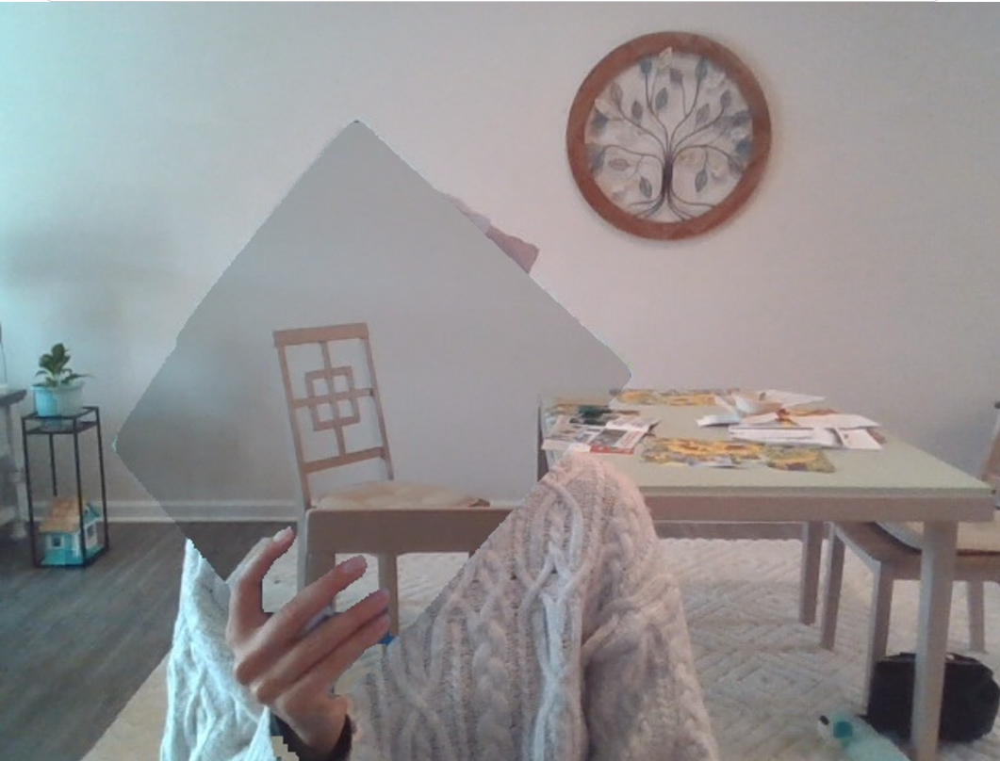

# Real-Time Video with Color Masking

This project uses Dash to create a real-time video feed application that allows users to apply color masking filters on a video stream. The application provides a dropdown menu for users to select different color filters (such as red, green, or blue) and applies the chosen mask to the video in real-time.

## Features

- Real-time video streaming.
- Dynamic color masking applied to the video feed.
- User-friendly interface with a dropdown to select color filters.
- Responsive layout for different screen sizes.

## Requirements

To run this project, you'll need to have Python 3.x installed along with the following libraries:

- Dash
- OpenCV (for handling video feed)
- NumPy (for array manipulation)
- Pillow (for image processing)
- Flask (for web framework)

You can install the required dependencies by running the following command:

```bash
pip install dash opencv-python numpy pillow flask
```

## Project Setup

1. **Clone the repository**:

   ```bash
   git clone <repository_url>
   cd <repository_name>
   ```

2. **Run the app**:

   After installing the dependencies, you can run the Dash app with the following command:

   ```bash
   python app.py
   ```

   The app will start a local web server, and you can access the video stream by navigating to `http://127.0.0.1:8050/` in your browser.

## How it Works

- The app streams a video feed captured using OpenCV.
- The user can select a color filter (Red, Green, Blue, etc) from a dropdown.
- Based on the selected color, the corresponding mask is applied to the video feed in real-time.
- The app uses Dash for the front-end interface and Flask to serve the video stream.

## Example

Here is a screenshot showing how the color masking is applied to the video stream in real-time:



## File Structure

```
.
├── app.py              # Main Dash app file
├── requirements.txt     # List of project dependencies

```

- `app.py`: Contains the main Dash app logic and video streaming setup.
- `requirements.txt`: Contains all the Python dependencies required for the project.
- `assets/`: This is an optional directory where you can place additional resources such as images, CSS, and JavaScript files for styling or further customization.

## Customization

- You can modify the available color filters in the `color_ranges` dictionary in `app.py` by adding or removing keys/values.
- Adjust the layout or styling of the app in the `app.layout` section to change the visual presentation.
- To use a different video feed source, modify the `cv2.VideoCapture` source in the app.

## License

This project is licensed under the MIT License - see the [LICENSE](LICENSE) file for details.

## Acknowledgements

- [Dash](https://dash.plotly.com/) for the web framework.
- [OpenCV](https://opencv.org/) for video processing.
- [NumPy](https://numpy.org/) for array manipulation.
- [Pillow](https://python-pillow.org/) for image processing.
